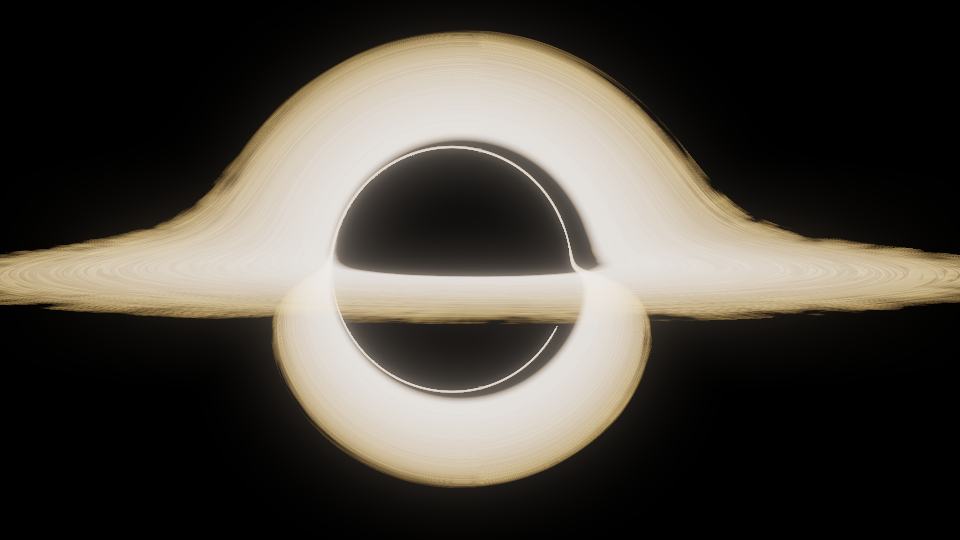

# Gargantua

Physically accurate Kerr black hole raytracer using geodesic integration on GPU.
Reproduces the gravitational lensing seen in the movie *Interstellar*, based on the
equations from the original visual effects paper by the film's scientific advisor.




## The Paper

This implementation follows **James, von Tunzelmann, Franklin & Thorne (2015)**,
*"Gravitational Lensing by Spinning Black Holes in Astrophysics, and in the Movie Interstellar"*
([arXiv:1502.03808](https://arxiv.org/abs/1502.03808)). The DNGR (Double Negative
Gravitational Renderer) team at Double Negative VFX developed the original renderer
for the film; this project reimplements their core algorithm from scratch in a single
CUDA source file.


## Mathematical Background

### Kerr Metric

The spacetime geometry of a spinning black hole of mass $M$ and angular momentum
$J = aM$ is described by the Kerr metric in Boyer-Lindquist coordinates
$(t, r, \theta, \phi)$. The key metric functions are:

$$
\Sigma = r^2 + a^2 \cos^2\theta, \qquad
\Delta = r^2 - 2Mr + a^2
$$

$$
A = (r^2 + a^2)^2 - a^2 \Delta \sin^2\theta
$$

The lapse $\alpha$, frame-dragging angular velocity $\omega$, and cylindrical radius
$\varpi$ of the FIDO (fiducial observer) are:

$$
\alpha = \frac{\sqrt{\Sigma \Delta}}{\sqrt{A}}, \qquad
\omega = \frac{2aMr}{A}, \qquad
\varpi = \frac{\sqrt{A} \sin\theta}{\sqrt{\Sigma}}
$$


### Geodesic Equations

Photon trajectories are null geodesics with two constants of motion: the impact
parameter $b = p_\phi$ and the Carter constant $q$. The super-Hamiltonian
(paper Eq. A.15) governs the evolution:

$$
\mathcal{H} = -\frac{\Delta}{2\Sigma}p_r^2 - \frac{1}{2\Sigma}p_\theta^2
+ \frac{R + \Delta\,\Theta}{2\Delta\,\Sigma}
$$

where the radial and angular potentials are:

$$
R = P^2 - \Delta\left[(b - a)^2 + q\right], \qquad
P = r^2 + a^2 - ab
$$

$$
\Theta = q + a^2\cos^2\theta - \frac{b^2\cos^2\theta}{\sin^2\theta}
$$

The five equations of motion $\dot{r}$, $\dot{\theta}$, $\dot{\phi}$,
$\dot{p}_r$, $\dot{p}_\theta$ are the analytical partial derivatives of
$\mathcal{H}$ with respect to the canonical variables — implemented in
`geodesicRHS()`.

### Camera Model

The camera is a FIDO (Fiducial Observer) at position $(r_c, \theta_c)$ in
Boyer-Lindquist coordinates (paper Eqs. A.11–A.12). Each pixel maps to a
direction in the FIDO's local frame:

$$
\hat{n}_F = -\hat{e}_r + v\,\hat{e}_\theta + u\,\hat{e}_\phi
$$

The initial canonical momenta and Carter constant are computed from the FIDO
frame projection and the local metric.

### Accretion Disk

The thin accretion disk follows the **Novikov-Thorne** temperature profile:

$$
T(r) = T_0 \left[\frac{1}{r^3}\left(1 - \sqrt{\frac{r_{\text{ISCO}}}{r}}\right)\right]^{1/4}
$$

normalised so that $T_0$ is the peak temperature. The inner edge is at the
innermost stable circular orbit (ISCO), which for spin $a/M = 0.6$ is at
$r_{\text{ISCO}} \approx 3.83\,M$.

The relativistic **g-factor** (ratio of observed to emitted frequency)
accounts for Doppler shift and gravitational redshift:

$$
g = \frac{1}{u^t_{\text{emit}}\,(1 - b\,\Omega_K)}
$$

where $\Omega_K = 1/(a + r^{3/2})$ is the Keplerian angular velocity.
Specific intensity transforms as $I_{\text{obs}} \propto g^3\,I_{\text{emit}}$
by Liouville's theorem.

Temperature is converted to color via the CIE blackbody approximation.
Procedural fBm noise modulates the disk boundaries to produce the frayed,
filamentary structure described in Section 4.3.2 of the paper.


## What Makes This Special

- **From scratch** — no game engine, no middleware, just C++/CUDA
- **Single file** — the entire raytracer is `gargantua_cuda.cu` (~960 lines)
- **Dual GPU/CPU** — CUDA on NVIDIA GPUs, OpenMP fallback with `-DCPU_ONLY`
- **Real geodesics** — full Kerr metric integration, not approximations
- **Physically based** — Novikov-Thorne disk, blackbody emission, relativistic beaming
- **Interstellar-accurate** — spin $a = 0.6$, Doppler off, matching the film's artistic choices


## Features

- 4th-order Runge-Kutta geodesic integration with adaptive step size
- 2×2 stratified supersampling (anti-aliasing)
- Multiple disk crossings (primary, secondary, and higher-order images)
- Semi-transparent disk compositing with alpha blending
- Procedural Perlin fBm noise for frayed disk edges and filaments
- Multi-pass Gaussian bloom post-processing
- Reinhard tone mapping with configurable exposure
- Row-batch CUDA kernel launches (Windows TDR-safe)
- Automatic ISCO computation from spin parameter


## Configuration

All parameters live in the `Config` struct at the top of `gargantua_cuda.cu`:

| Parameter | Default | Description |
|-----------|---------|-------------|
| `W` × `H` | 1920 × 1080 | Image resolution |
| `a_spin` | 0.6 | Kerr spin parameter $a/M$ (Interstellar value) |
| `cam_r` | 65.0 | Camera radial distance ($M$ units) |
| `cam_th` | 1.50 | Camera polar angle (rad, ≈ 86°) |
| `fov_deg` | 20.0 | Field of view (degrees) |
| `maxSteps` | 5000 | Maximum RK4 integration steps per ray |
| `stepSize` | 0.03 | Base affine parameter step |
| `disk_Rin` | ISCO | Inner disk edge (auto-computed) |
| `disk_Rout` | 22.0 | Outer disk edge ($M$ units) |
| `disk_T0` | 4500 | Base disk temperature (K) |
| `doDoppler` | false | Doppler shift (off = Interstellar movie mode) |
| `doIntensity` | false | $g^3$ intensity beaming |
| `bloomSigma` | 4.0 | Bloom blur radius |
| `bloomPasses` | 4 | Number of bloom blur passes |
| `bloomStrength` | 0.30 | Bloom intensity |
| `exposure` | 2.2 | Tone map exposure |


## Prerequisites

- **CUDA Toolkit** (tested with 12.x)
- **NVIDIA GPU** (tested on RTX 4070 SUPER, compute capability 8.9)
- **Visual Studio 2022** (Windows) or `nvcc` on PATH (Linux)

For CPU-only builds, only a C++11 compiler with OpenMP is needed.


## Build

### Windows

```bat
build_cuda.bat
```

### Linux

```bash
chmod +x build_cuda.sh
./build_cuda.sh
```

### CPU-only (no GPU required)

```bash
g++ -O3 -fopenmp -x c++ -DCPU_ONLY gargantua_cuda.cu -o gargantua_cpu -lm
```


## Run

```bash
./gargantua_cuda
```

Output is `gargantua.ppm` (NetPBM format). Convert to PNG:

```bash
ffmpeg -i gargantua.ppm gargantua.png
```


## Volume Generator

The `volume_generator/` directory contains a separate tool that generates 3D
volumetric data of the Kerr black hole for use in **Blender**, **Houdini**, or
**ParaView**.

It exports 13 physical channels (horizon SDF, ergosphere SDF, accretion disk
density and temperature, Keplerian velocity field, and 5 Kerr-Schild metric
components) in a custom `.bhvol` binary format.

**OpenVDB export** is supported via `convert_to_vdb.py` — converts `.bhvol` to
standard `.vdb` files that can be loaded directly as volume objects in Blender
or Houdini. Horizon mesh export to `.glb` (glTF) is also available via
`export_horizon_mesh.py`.

The full Kerr-Schild metric can be reconstructed at any voxel from the stored
channels:

$$
g_{\mu\nu} = \eta_{\mu\nu} + f \cdot l_\mu \, l_\nu
$$

This gives all 10 independent components of the spacetime metric in
horizon-penetrating coordinates — no coordinate singularity at the event
horizon.

See [volume_generator/README.md](volume_generator/README.md) for build
instructions, CLI options, the `.bhvol` format specification, and a path-tracer
integration guide.


## References

- James, O., von Tunzelmann, E., Franklin, P. & Thorne, K. S. (2015).
  *Gravitational Lensing by Spinning Black Holes in Astrophysics, and in the
  Movie Interstellar.* Classical and Quantum Gravity, 32(6).
  [arXiv:1502.03808](https://arxiv.org/abs/1502.03808)

- [kavan010/gravity_sim](https://github.com/kavan010/gravity_sim) — Related
  N-body gravity simulation project


## License

[MIT](LICENSE)
